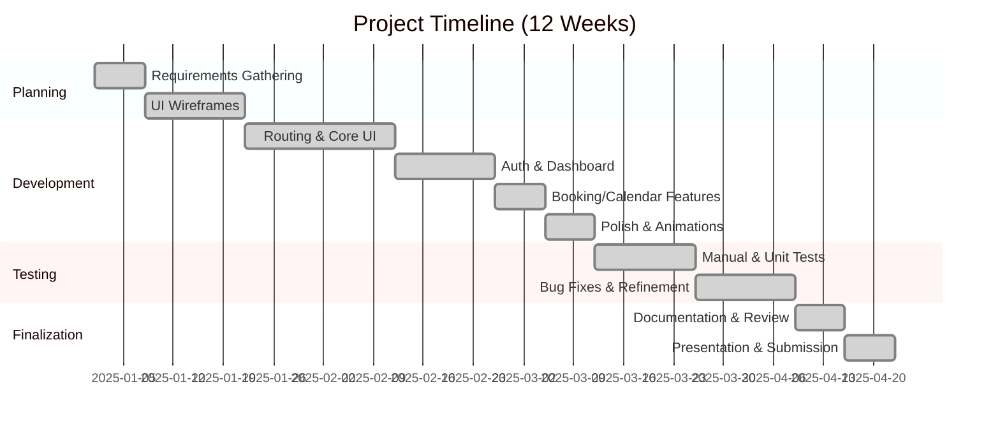
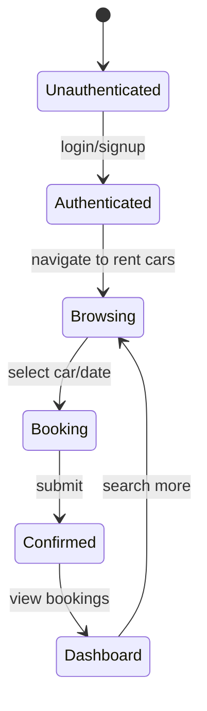
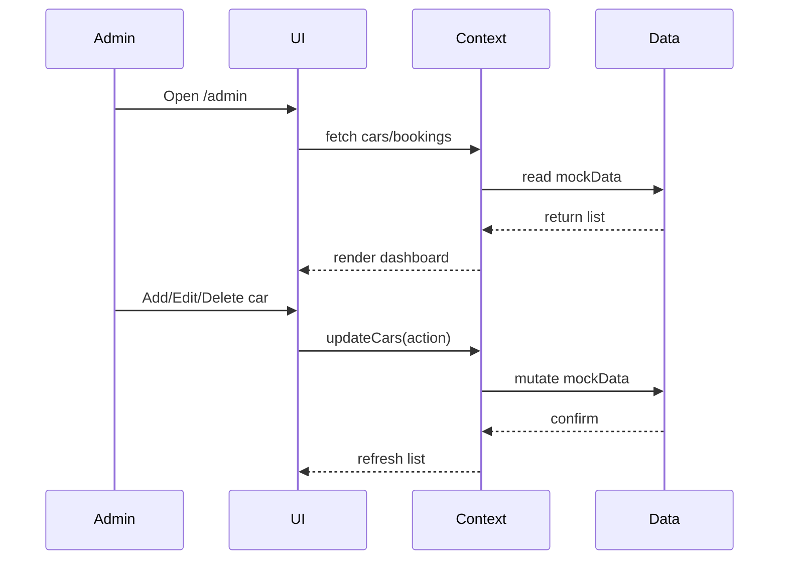

# Project Diagrams and Charts

This document contains diagrams to support the Vintage Rides Hub project report.

## 1. Gantt Chart (Milestones)



_(Dates are illustrative and should correspond to the actual schedule defined in the report.)_

## 2. System Architecture Diagram

```mermaid
flowchart LR
    subgraph Frontend
        A[React Components]
        B[CarContext / AuthContext]
        C[Routing (react-router-dom)]
    end
    subgraph Data
        D[mockData.js (Cars, Users, Bookings)]
    end
    subgraph Browser
        A --> B
        B --> C
        C --> D
    end
```

## 3. State Transition Diagram (User)



## 4. Workflow for Admin



## 5. Gantt Chart Image

You may also insert a screenshot or external image of the Gantt chart generated in spreadsheets here if required.

---

Additional diagrams (e.g., class diagrams, network charts) can be added as needed.
